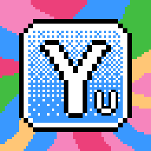

<section class="yuumix-section yuumix-section--hero" id="hero" data-mood="chill">
  

  

    
    

      
Yuumix 说:

      
嘿!我是 Yuumix,顺便做点 Unity 插件。

    

  

  <h1 class="yuumix-title">Y U U M I X</h1>
  
Runestone · 符文石 · Unity 插件作者

  <a href="#about" class="yuumix-cta">▶ 继续往下看</a>
  
▼ 向下滚动 ▼

</section>

<section class="yuumix-section yuumix-section--about" id="about" data-mood="chill">
  

    
    

      
Yuumix 说:

      
我是个独立开发者,做些能省时间的工具。

    

  

  

    <h2>关于我</h2>
    
独立 Unity 开发者,做工具、编辑器扩展、写写笔记。踩过的坑都记下来,省的以后再栽一次。

  

</section>

# Yuumix Code { #intro-start }

独立 Unity 开发者的工作笔记与开源作品。踩过的坑、写的工具、读过的源码。

## 内容导览

- **[Aesir Architecture](aesir-architecture/index.md)** — Unity 渐进式 MVP 架构框架,PlayerLoop 原生,MIT 协议
- **[Aesir Inspector](aesir-inspector/index.md)** — Unity 编辑器扩展:双语 Inspector / 文档生成器 / 安全工具集
- **[Odin Inspector 实战](odin-inspector/getting-started.md)** — 7 篇从入门到坑点的实战指南
- **[Unity Localization 踩坑日志](unity-knowledge/localization/unity-localization-pitfall-log.md)** — 3 个真实坑 · Mermaid 序列图 + C# 修复方案
  - [踩坑问答](unity-knowledge/localization/localization-question.md)
- **[Addressables FAQ](unity-knowledge/addressables/addressable-faq.md)** — Addressables 实战问答
- **[qiaomu-bento-ppt 使用指南](ai/bento-presentation-guide.md)** — 把单文件 bento 演示文稿通过 iframe 嵌进本站的完整做法 + 限制清单

<section class="yuumix-section yuumix-section--contact" id="contact" data-mood="friendly">
  

    
    

      
Yuumix 说:

      
想聊合作?来敲我!

    

  

  

    <h2>联系</h2>
    <ul>
      <li>📦 <a href="https://github.com/yuumixcode">GitHub · yuumixcode</a></li>
      <li>🌐 本站源码: <a href="https://github.com/yuumixcode/yuumixcode.github.io">yuumixcode.github.io</a></li>
    </ul>
  

</section>

