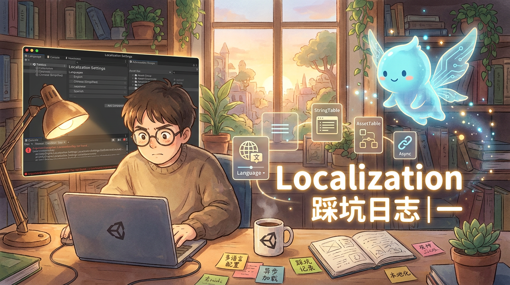

# Localization 踩坑日志

> Unity 2022.3.62f3c1 | Localization 1.5.3 | Addressables 1.22.3

---

!!! tip "想看幻灯片版?"
    整理成了 15 页 slides，适合分享 / 投影。[👉 在新窗口打开](slides/unity-localization-pitfall-log-slides.html){target="_blank" rel="noopener"}

## 一、禁止在 InitializationOperation 的 Completed 事件中调用 SetSelectedLocale

### 原因简析

`Completed` 事件在 `Complete()` **内部**同步触发，此时调用栈尚未展开——你仍然在 Addressables 的完成逻辑中。

`SetSelectedLocale` 内部会启动新的异步操作链（`ReleaseAllTables` → 重新加载新语言的 StringTable / AssetTable），而此时 init 预加载的 bundle 仍留在 `VirtualAssetBundleProvider` 的 `m_ActiveBundles` 字典中尚未清理。`ReleaseAllTables` 只释放表资源引用，不从字典中移除 bundle——加载新表时 `m_ActiveBundles.Add(key, bundle)` 撞上同一个 key，直接抛 `ArgumentException: An item with the same key has already been added`。

崩溃时序：

```
① PreloadTables() → bundle Add 进字典
② Complete() 执行 → 同步触发 Completed 回调
   └→ SetSelectedLocale()
       └→ ReleaseAllTables()    ← 只释放表引用，bundle 仍留在字典
       └→ 加载新语言的表 → Add 同一个 key → 💥
③ Complete() 返回（永远到不了这里）
```

> **补充原则**：`Completed` 回调本身是安全的同步委托调用，在其中执行普通同步 Unity API（如 `SetActive`、设置文本、读取已加载的数据）没有问题。限制仅在于——**不要在回调中启动新的 Addressables 异步操作链**。`SetSelectedLocale` 内部会这么做，所以不能在 `Completed` 里调用它。

### 推荐方式

#### 方式 A：自定义 IStartupLocaleSelector（推荐）

把语言选择烘焙进初始化流程，完全不需要手动调用 `SetSelectedLocale`：

```csharp
[Serializable]
public class SavedLocaleSelector : IStartupLocaleSelector
{
    public Locale GetStartupLocale(ILocalesProvider availableLocales)
    {
        var code = 从存档读取语言代码();
        if (string.IsNullOrEmpty(code))
            return null;  // 交给下一个 Selector 决定
        return availableLocales.GetLocale(new LocaleIdentifier(code));
    }
}
```

在 `LocalizationSettings.asset` Inspector 中，添加到 **Startup Locale Selectors 列表第一位**。

零冗余——初始化流程从一开始就知道该选什么语言，不会先加载默认语言再切换。

#### 方式 B：协程 yield return 等待 init 完成后再调用

```csharp
IEnumerator ApplySavedLocaleAfterInit()
{
    var op = LocalizationSettings.InitializationOperation;

    if (!op.IsDone)
        yield return op;  // 协程挂起，Complete() 返回后才恢复

    // 此时 init 已真正完成，调用栈已完全展开，安全
    var target = LocalizationSettings.AvailableLocales
        .GetLocale(new LocaleIdentifier(code));
    if (target != null)
        LocalizationSettings.SelectedLocale = target;
}
```

**为什么 `yield return` 安全而 `Completed` 回调不安全？**

`yield return op` 让协程挂起，等 `Complete()` **完全返回**、调用栈展开后才恢复执行——此时已脱离 Addressables 更新循环，启动新异步操作安全无冲突。`IsDone` 先检查处理边界情况：如果 init 在之前帧已完成，跳过 yield 直接设置即可。

---

## 二、切换语言时的闪烁问题

### 原因简析

`SetSelectedLocale` 会触发 `SendLocaleChangedEvents()`，所有 `LocalizedDatabase` 收到 `OnLocaleChanged` 后调用 `ReleaseAllTables()`——释放当前语言的 StringTable 和 AssetTable（字体等）引用。

如果代码中没有持有这些表的持久引用，Localization 系统认为它们"没人用了"，彻底释放。切换到新语言时，StringTable 和 AssetTable 是**独立的异步加载操作**，完成时间不一致——肉眼可见先变字体后变文本，或反之。

```
切换语言 A → B:
  ① ReleaseAllTables() → 释放 A 的所有表引用
  ② 加载 B 的表 → StringTable 异步加载，AssetTable 异步加载
  ③ 两个异步操作完成时间不同 → 闪烁

切换语言 B → A（切回来）:
  ① ReleaseAllTables() → A 的表刚加载完又被释放
  ② 重新加载 A 的表 → 同样的问题 → 闪烁
```

### 推荐方式

#### 方式 A：Preload All Tables（推荐，语言数量少时）

在 `LocalizationSettings.asset` 中勾选所有语言的 **Preload** 选项，让所有表在初始化时就全部加载并常驻内存。切换语言时表已在内存中，无需重新加载，文本和字体同时切换。

代价是内存占用增加。对于语言数量不多（2-5 种）的项目，这个代价可以接受。

#### 方式 B：手动持有 Table 引用

在代码中持有 `LocalizedStringTable` 等持久引用。它会订阅 `TableChanged` 事件，语言切换时系统为新语言重新加载表并通知你，而不是彻底释放。

---

## 三、退出游戏时禁止访问 LocalizationSettings.SelectedLocale

### 原因简析

退出 Play Mode 时，`LocalizationSettings` 的 `ResetState()` 被调用，清空 `m_SelectedLocaleAsync` 缓存。此后任何代码访问 `SelectedLocale`，都会**触发完整的重新初始化管线**——遍历所有 `IStartupLocaleSelector` 重新选择语言。

连锁反应：

```
退出 Play Mode
  └─ ResetState() → m_SelectedLocaleAsync = default（缓存清空）
  └─ 某处代码访问 SelectedLocale（如 OnGUI、存档回调）
       └─ GetSelectedLocaleAsync() → m_SelectedLocaleAsync 无效
            └─ SelectActiveLocale() → 遍历 Selectors
                 ├─ 自定义 SavedLocaleSelector → null（Domain 销毁中，访问上下文失败）
                 ├─ CommandLineLocaleSelector → null
                 └─ SystemLocaleSelector → 系统语言（如 ja）✓
            └─ SelectedLocaleChanged 事件触发
                 └─ 回调将错误的系统语言写入存档 → 💥
```

### 推荐方式

**核心原则：用字符串缓存语言代码，退出时读缓存而不碰 Localization 系统。**

```csharp
// Model 层 — 纯字段，不碰 LocalizationSettings
string _languageCode = "zh-CN";
public string CurrentLanguageCode => _languageCode;

// Service 层 — 通过事件同步，退出时先取消订阅再保存
void OnInitialize()
{
    LoadGameSettings();
    LocalizationSettings.SelectedLocaleChanged += OnSelectedLocaleChanged;
    Application.quitting += OnApplicationQuitting;
}

void OnSelectedLocaleChanged(Locale locale)
{
    if (locale != null)
        _languageCode = locale.Identifier.Code;
}

void OnApplicationQuitting()
{
    // 先断开事件订阅，阻止 Localization 清理时的回调覆盖 _languageCode
    LocalizationSettings.SelectedLocaleChanged -= OnSelectedLocaleChanged;
    SaveGameSettings();  // 再保存，此时 _languageCode 是用户选择的值
}
```
